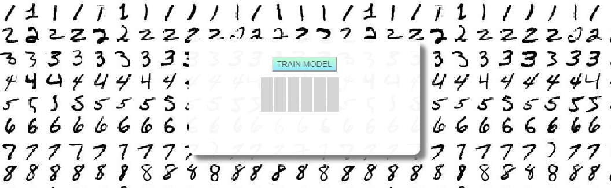
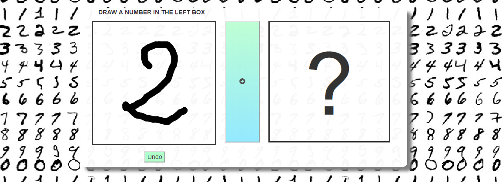

# Mnist, flask and Tensorflow

A flask app for playing with the Mnist dataset.


## Run the flask App
To run the app:
```
set FLASK_APP = app.py
flask run
```

Then connect to : http://127.0.0.1:5000/

## Usage

<p align="center"> First, Train the model </p>


<p align="center"> Then, Test the model by drawing number</p>


## Built with

* [flask](http://flask.pocoo.org/)

* [Tensorflow](https://www.tensorflow.org/)

* [Sketchpad](https://github.com/yiom/sketchpad) - Sketchpad to draw number


## Model Used ##

```
model = tf.keras.models.Sequential([
      tf.keras.layers.Conv2D(32, kernel_size=(3, 3),activation='relu',kernel_initializer='he_normal',input_shape=(28, 28, 1)),
      tf.keras.layers.Conv2D(32, kernel_size=(3, 3),activation='relu',kernel_initializer='he_normal'),
      tf.keras.layers.MaxPooling2D(pool_size=(2,2)),
      tf.keras.layers.Dropout(0.20),
      tf.keras.layers.Conv2D(64, (3, 3), activation='relu',padding='same',kernel_initializer='he_normal'),
      tf.keras.layers.Conv2D(64, (3, 3), activation='relu',padding='same',kernel_initializer='he_normal'),
      tf.keras.layers.MaxPool2D(pool_size=(2, 2)),
      tf.keras.layers.Dropout(0.25),
      tf.keras.layers.Flatten(),
      tf.keras.layers.Dense(128, activation='relu'),
      tf.keras.layers.BatchNormalization(),
      tf.keras.layers.Dropout(0.25),
      tf.keras.layers.Dense(10, activation='softmax')
```